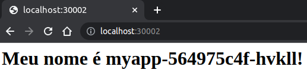

 

## O que é o Flask?

Ele é um micro-framework destinado principalmente a pequenas aplicações com requisitos mais simples, como por exemplo, a criação de um site básico.

## Qual é a vantagem dele frente a outros frameworks?  

`“Web development, one drop at a time”.`

O logo já resume bem como funciona esse framework. O Flask no Python é usado para construir sites, aplicativos web, API, etc.

A ideia dele é que você comece um site da forma mais simples possível e depois vá adicionando funcionalidades, “one drop at a time”, ou seja, uma de cada vez.

Ele é conhecido como um micro framework de desenvolvimento web, mas isso não significa que ele não desenvolva soluções completas.

O motivo de chamá-lo de micro framework é justamente por ele começar simples e ir ficando mais complexo à medida que se acrescentam funcionalidades.

## Características do Flask

- **`Simplicidade:`** Por possuir apenas o necessário para o desenvolvimento de uma aplicação, um projeto escrito com Flask é mais simples se comparado aos frameworks maiores, já que a quantidade de arquivos é muito menor e sua arquitetura é muito mais simples.

- **`Rapidez no desenvolvimento:`** Com o Flask, o desenvolvedor se preocupa em apenas desenvolver o necessário para um projeto, sem a necessidade de realizar configurações que muitas vezes não são utilizadas.

- **`Projetos menores:`** Por possuir uma arquitetura muito simples (um único arquivo inicial) os projetos escritos em Flask tendem a ser menores e mais leves se comparados a frameworks maiores.

- **`Aplicações robustas:`** Apesar de ser um micro-framework, o Flask permite a criação de aplicações robustas, já que é totalmente personalizável, permitindo, caso necessário, a criação de uma arquitetura mais definida.

Para maiores informações, acessar o site do [Flask](https://flask.palletsprojects.com/en/2.3.x/)

## A Aplicação

Será implantada uma aplicação simples que exibirá o nome do pod e o seu ip onde está sendo executada. Será exposta na porta **`5000`** e o serviço irá expor o aplicativo na porta **`80`** e estará acessível por meio do NodePort **`30002`**.

 

